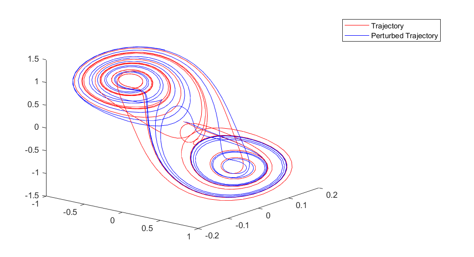
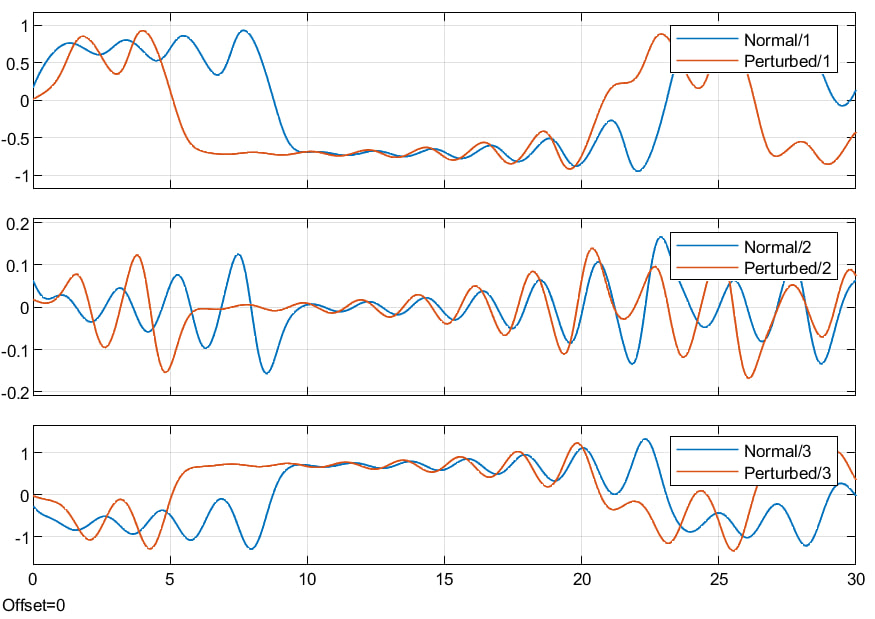
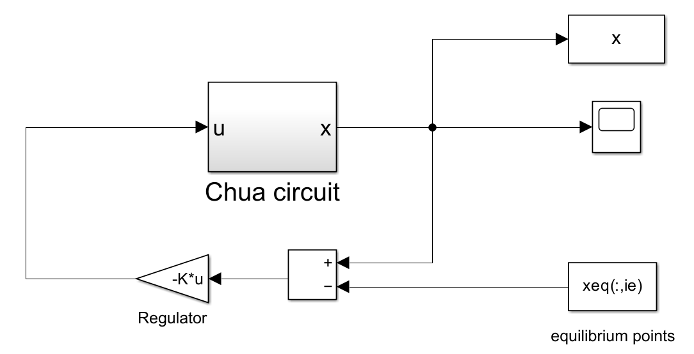

# Lab 01

Study of the (chaotic) Chua system. Comparison free evolution of the system trajectory with a given starting condition (red) and its perturbation (blue).

In a chaotic system, infact, a small change in the initial condition doesn't correspond to a small change in the trajectory devolution, as seen in detail: 

**Linearization through Lyapunov Method**

Once found the equilibrium points by linearizing it through the Lyapunov Direct Method, one can treat such a system as if it was a linear one. In this very specific case, I made sure the trajectory would follow the equilibrium point by appliyng a linear regulator.

