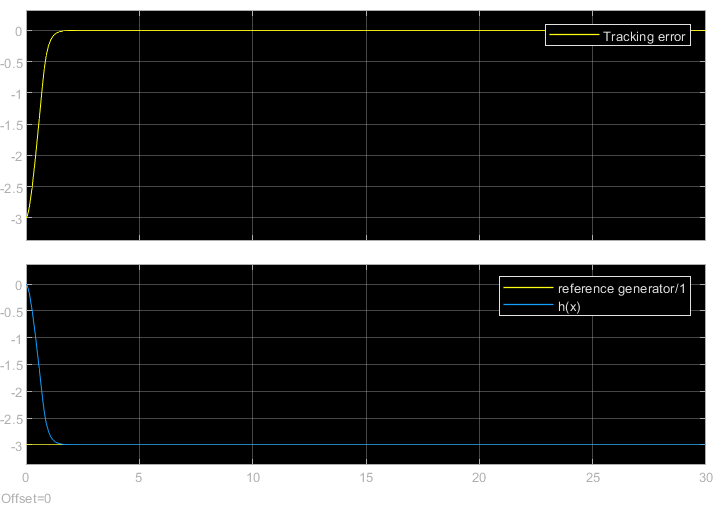

# Lab03

Control of a nonlinear system through Sliding Mode Control (SMC)

The sliding mode control, offers a higher robustness compared to the Feedback linearization, due to the final linear term (instead of the nonlinear one)

$$v = r^{(\gamma)} + k_\gamma \tilde \mu_\gamma + \cdots + k_2 \tilde \mu_2 + k_1 \sigma(\eta s)$$

Where 
- The vector $\tilde \mu = (\tilde \mu_1, \cdots, \tilde \mu_\gamma) \doteq (\tilde y, \dot {\tilde y}, \cdots, {\tilde y}^{(\gamma -1)})$ where $\tilde y$ is the tracking error.
- **s** is the sliding window, defined as $s(x, t) \doteq \tilde \mu_\gamma + k_\gamma \tilde \mu_{\gamma-1} + \cdots + k_2 \tilde \mu_1 $
- $\eta$ is a coefficient parameter, set in this case to $1$

The simulink schematics is

Due to the system definitions, the only parameters that need tuning were $k_1$ and $k_2$.
- Choosing them as $k_1=20, k_2=5$ I obtained the following results:

- Choosing them as $k_1=1, k_2=1$ I obtained the following results:

