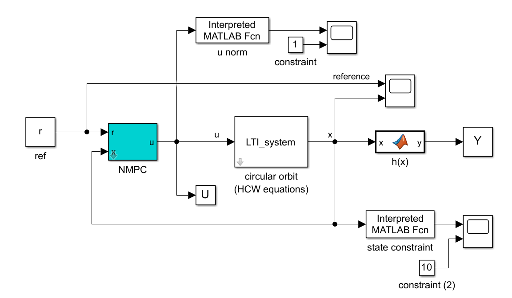
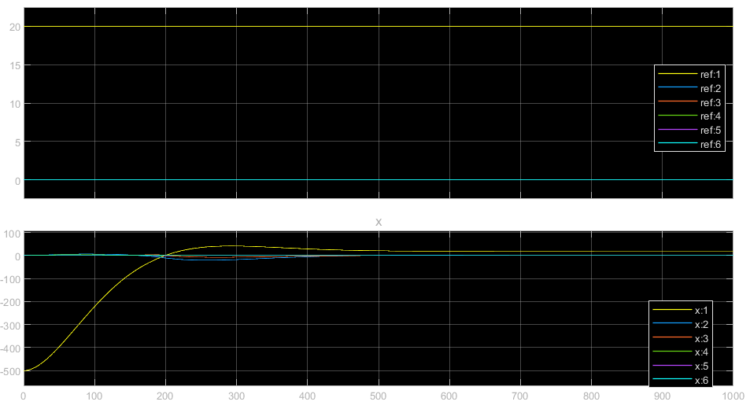
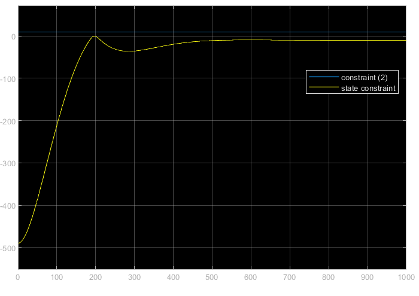
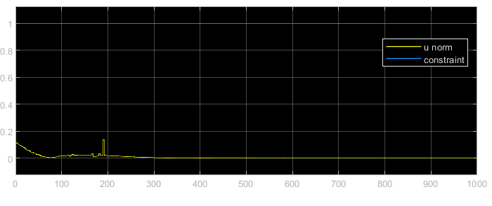
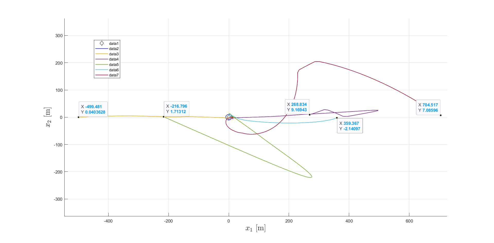
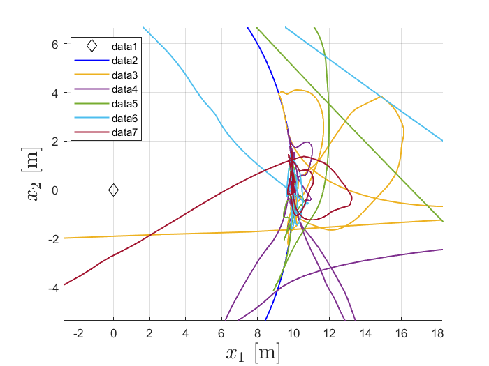

# Lab 04

Control of a linear system through Nonlinear Model Predictive Control (NMPC) block. Why? Because it's the first time doing it and we're doing something easy. Here's an overview of the whole scheme:



The (blue) NMPC block solves the optimization problem as stated in the theory. Since the system is linear, it behaves exactly like a standard MPC. The generated command $u$ is fed into a LTI whose output is the system state $x$, sent back to the NMPC through a feedback action. The computed state and command inputs are compared to their respective constraints. As seen in the graph below, the NMPC makes sure the system state successfully tracks the reference value (arbitraily chosen as $[20, 0, 0, 0, 0 ,0]$), given any initial condition $x_0$ (arbitraly chosen as $[500, 0, 0, 0, 0 ,0]$ ):



Both the command effort and state respect the given constraints





To get more readable results, I ran the experiment with multiple initial conditions (the columns of the matrix below), and printed the first two state variables $x_1$, $x_2$ in a plane, including the planet orbit. I also changed the reference value to $[10, 0, 0, 0, 0 ,0]$

``` MATLAB
  268.8336  -216.7960 362.7021 704.5172
  9.1694    1.7131    -0.3153  7.0860
  -11.2942  17.8920   3.5737   3.3575
  4.3109    13.8472   -1.0248  -6.0374
  1.5938    -6.7494   -0.6207  3.5862
  -6.5384    15.1746  7.4485   8.1512
```

This is the full trajectory of the first two variables



... and here's a messy close-up shows the controller successfully reached the reference value

