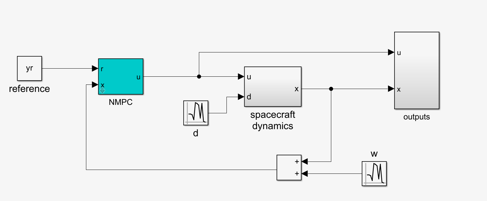
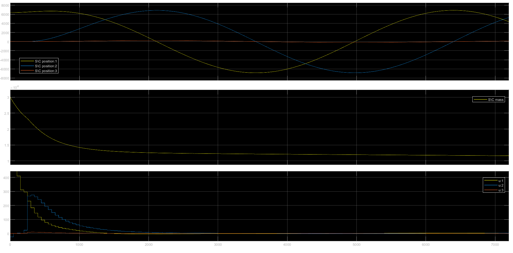
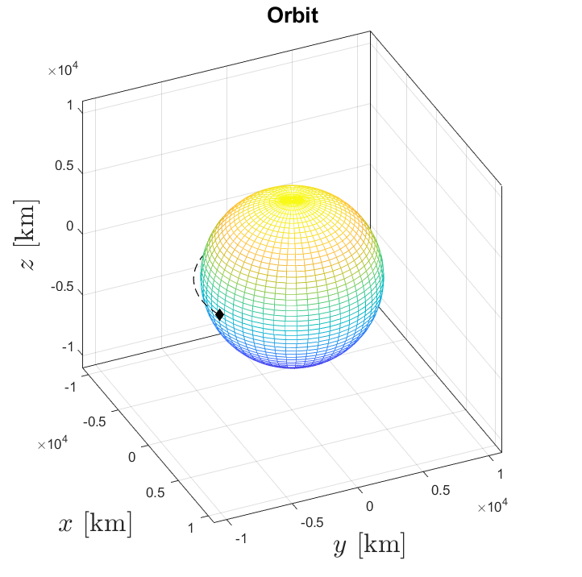

# Lab 09

Control of a spacecraft (sometimes called *S\C*), a nonlinear system, through NMPC. The schematics used for solving this lab is:

The block outputs contains blocks and logic used to produce the graphs and animation, and as such is not worth mentioning.

Since the reference is expressed with orbital elements, and the spacecraft dynamics works with different variables, ($x = [r, v, m]$, respectively the position, velocity and mass of the S\C), I had to convert the latter as studied in the theory. Luckily, there was an already made block that did that for me.

Read [lab04](../lab04/) for the NMPC block explaination

The S\C movement in orbit

I also recorded a video but it was moving so slow it wasn't worth showing it. You can find a 15s snippet [here](../images/lab09_orbit_snippet.mp4).